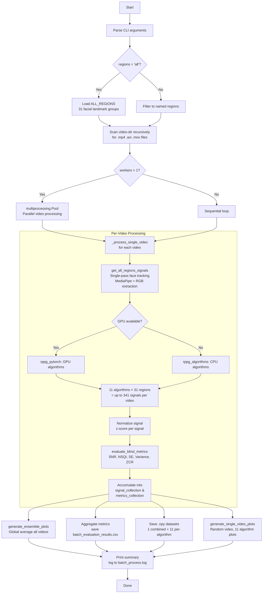

# `batch_process.py` — Workflow Documentation

A batch rPPG (remote photoplethysmography) pipeline that processes face videos, applies 11
signal-extraction algorithms across 31+ facial regions, and outputs ensemble plots,
evaluation metrics, and structured `.npy` datasets for downstream Deep Learning.

---

## Quick Start

```bash
# Basic run (sequential, CPU, all regions)
python3 batch_process.py --video-dir /path/to/videos

# Full options
python3 batch_process.py \
    --video-dir /path/to/videos \
    --max-frames 1800 \          # 60 s @ 30 fps
    --max-videos 50 \            # limit number of videos
    --regions all \              # or comma-separated region names
    --plots-dir ensemble_plots \ # output directory
    --workers 8 \                # parallel workers
    --use-gpu                    # enable GPU via PyTorch
```

---

## End-to-End Execution Flow



---

## Step-by-Step Description

### 1. Argument Parsing & Setup
The script parses CLI flags and creates the output directory (`--plots-dir`).

### 2. Region Selection
`ALL_REGIONS` is defined in `roi_definitions.py` and maps 31 facial region names to
MediaPipe FaceMesh landmark index lists (e.g. `upper_medial_forehead`, `left_malar`, `chin`).

### 3. Video Discovery
All `.mp4 / .avi / .mov` files are recursively discovered under `--video-dir`. An optional
`--max-videos` cap limits the run to the first N files.

### 4. Parallel vs Sequential Processing
When `--workers > 1`, a `multiprocessing.Pool` with a shared `Manager` dict is used
so worker processes can safely write to shared signal/metrics collections.

### 5. Per-Video Processing (`_process_single_video`)
This is the core function:
1. **Single-pass extraction** — `get_all_regions_signals` runs MediaPipe face tracking
   once per video and simultaneously extracts mean RGB for all 31 regions. This avoids
   reading the video 31× (a 31× speedup).
2. **Algorithm application** — For each (region, algorithm) pair, the raw RGB signal is
   processed into a normalized BVP (blood volume pulse) signal.
3. **GPU fallback** — If `--use-gpu` is set and CUDA/MPS is available, PyTorch
   implementations in `rppg_pytorch.py` are used. Falls back to NumPy/SciPy on failure.
4. **Blind metric evaluation** — `evaluate_blind_metrics` calculates SNR, NSQI, PSD Peak,
   Spectral Entropy, Variance, and Zero-Crossing Rate for each signal.
5. **Z-score normalization** — Each signal is normalized before being stored.

### 6. Ensemble Plot (`global_ensemble_summary.png`)
All collected signals (across all videos) are resampled to a common length and ensemble-
averaged per algorithm. A single plot shows the mean ± 0.5 SD band for each algorithm.

### 7. Metrics CSV (`batch_evaluation_results.csv`)
Average blind metrics per (region, algorithm) pair are exported to CSV.

### 8. Dataset Save (`.npy` files)
**12 files are saved:**
- `rppg_signals_dataset.npy` — Combined: `{region: {algorithm: ndarray(N, L)}}`
- `rppg_signals_POS.npy`, `rppg_signals_CHROM.npy`, … (one per algorithm)
  — Each: `{region: ndarray(N, L)}` where N = number of videos, L = `max_frames`

### 9. Single-Video Algorithm Plots (`single_video_{ALGO}.png`)
One video is chosen at **random** from the processed set. It is re-run through all
algorithms, and 11 plots are saved — one per algorithm — each showing the normalized
rPPG signal for every facial region overlaid on the same axes.

---

## Algorithms

| # | Name | Full Name | Key Idea |
|---|------|-----------|----------|
| 1 | **POS** | Plane-Orthogonal-to-Skin | Projects skin-reflected light onto a plane orthogonal to the skin-tone direction |
| 2 | **CHROM** | Chrominance-based | Uses skin-color chrominance (normalized R/G and B/G differences) |
| 3 | **ICA** | Independent Component Analysis | Demixes color channels into statistically independent signals |
| 4 | **SSR** | Spatial Subspace Rotation | Tracks temporal rotation of the signal subspace |
| 5 | **GREEN** | Green Channel | Simplest baseline: uses the green channel only (peak hemoglobin absorption) |
| 6 | **PCA** | Principal Component Analysis | Finds principal components of RGB; first PC often captures pulse |
| 7 | **PBV** | Pulse Blood Volume | Uses known blood-volume-pulse spectral profile to separate signal from noise |
| 8 | **LGI** | Local Group Invariance | Exploits local symmetry properties of skin reflectance |
| 9 | **OMIT** | Orthogonal Matrix Image Transformation | Uses orthogonal projection to suppress motion artifacts |
| 10 | **SAMC** | Self-Adaptive Matrix Completion | Adaptive matrix approach for robust signal recovery |
| 11 | **2SR** | Two-Stage Reconstruction | Two-step reconstruction: signal separation then artifact removal |

All algorithms output a bandpass-filtered BVP signal in the physiological HR range
(42–180 BPM, i.e. 0.7–3.0 Hz), as configured in `config.py`.

---

## Output Files

| File | Description |
|------|-------------|
| `global_ensemble_summary.png` | Ensemble average of all algorithms across all videos |
| `single_video_{ALGO}.png` × 11 | Per-algorithm rPPG signal plot for one random video (all regions) |
| `batch_evaluation_results.csv` | Blind quality metrics per (region, algorithm) |
| `rppg_signals_dataset.npy` | Combined signal dataset — all algorithms, all regions |
| `rppg_signals_{ALGO}.npy` × 11 | Per-algorithm dataset — shape `{region: (N_videos, L)}` |
| `batch_process.log` | Full execution log |

---

## Key Source Files

| File | Role |
|------|------|
| `batch_process.py` | Main orchestration script |
| `config.py` | Algorithm list, frequency band, video folder |
| `roi_definitions.py` | 31 facial region → landmark mapping |
| `signal_extraction.py` | MediaPipe face tracking + RGB extractor |
| `rppg_algorithms.py` | CPU implementations of all 11 algorithms |
| `rppg_pytorch.py` | GPU (PyTorch/CUDA/MPS) implementations |
| `evaluation.py` | Blind & reference-based metric functions |
