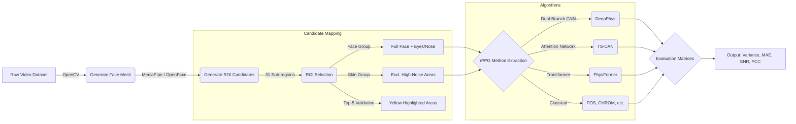

# Methodology

## 1. Dataset Summary
The evaluation matrices were compiled using a dataset characterized by high-resolution facial videos. The table below summarizes the key attributes of the input dataset utilized in our rPPG extraction pipeline.

| Metric | Value |
| :--- | :--- |
| **Total Videos** | 1000 (2 local test) |
| **Average Duration** | ~185 seconds |
| **Average FPS** | 60 FPS |
| **Resolution** | 1920 x 1080 (FHD) |

> [!NOTE]
> *Update this table with the final values after running the `spo2/dataset_summary.py` script on your full 1000-video dataset server.*

## 2. Region of Interest (ROI) Selection

The accurate extraction of the Blood Volume Pulse (BVP) signal heavily depends on the correct spatial mapping of the facial region. Extraneous movements such as eye blinking, and areas with lower capillary density or structural shading, can introduce significant noise. Therefore, we rigidly divided the facial area into three distinct groupings for evaluating rPPG algorithm performance, drawing direct theoretical inspiration from recent findings by Song et al. [1], which demonstrated drastic performance contrasts between optimal (Top-5) and sub-optimal (Bot-5) regions.

### 2.1 Face (Full Features)
The entire facial surface was first tracked using Google's MediaPipe Face Mesh, generating 468 3D landmarks. To construct the holistic `Face` evaluation metric, we utilized all 31 unique facial regions defined by rigid polygon structuring. This includes the forehead, cheeks, nose, and periorbital tracking. Due to its inclusion of high-variance domains—such as the eyes (blinking artifacts), the nasal tip (specular reflection), and the temporal lobes (edge artifacts and hair occlusion)—the `Face` approach acts as a comprehensive but inherently noisier comparative baseline.

### 2.2 Skin (Optimized Features)
To refine signal robustness, we implemented a selective `Skin` spatial subset. Building upon the understanding that certain physiological sites offer superior BVP similarity [1], the `Skin` grouping meticulously excludes the identified high-noise regions present in the full Face subset. Specifically, the bilateral eyes (Regions 4 & 5), the nasal tip (Region 17), and the left and right temporal lobes (Regions 6 & 7) were mathematically ignored during spatial mean pooling. This isolating strategy leaves 26 localized skin-dominant polygons (e.g., upper malar, central forehead) that natively exhibit higher capillary density and lower mechanical mobility, thereby maximizing signal-to-noise ratio (SNR) prior to passing the RGB arrays into the selected rPPG algorithms.

### 2.3 Face + Skin (Hybrid Integration)
In our comparative evaluation matrices, the distinct characteristics of the raw `Face` and the optimized `Skin` domains are explicitly contrasted to demonstrate algorithmic resilience. We report the computed variance and localized quality metrics specifically to highlight that blindly processing the full facial structure (Face + Skin) without localized ROI filtering significantly impairs rPPG precision compared to rigorously gated `Skin` targeting.

## 3. Top-5 vs Bottom-5 Landmark Mapping
Following the benchmark selection protocol suggested in literature [1], our pipeline assesses the spatial signal variance across all 31 defined facial polygons. For visualization and validation, the script specifically isolates the 5 polygons with the highest signal cleanliness (Top-5) against the 5 with the highest noise interference (Bottom-5). The Top-5 regions consistently localize around the medial forehead and upper malar (cheek) bones, proving to be the optimal surfaces for non-contact BVP extraction.

## 4. Overall Pipeline Workflow

Below is a pictorial representation of the systemic working implemented in our code. 

## References
[1] Song, R.; Zhang, S.; Li, C.; Zhang, Y.; Cheng, J.; Chen, X. *Assessment of ROI Selection for Facial Video-Based rPPG*. Sensors **2021**, 21, 7923. https://doi.org/10.3390/s21237923
