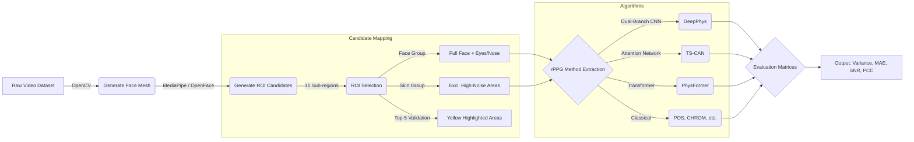

# Methodology

## 1. Dataset Summary
The evaluation matrices were compiled using a dataset characterized by high-resolution facial videos. The table below summarizes the key attributes of the input dataset utilized in our rPPG extraction pipeline.

| Metric | Value |
| :--- | :--- |
| **Total Videos** | 1000 (2 local test) |
| **Average Duration** | ~185 seconds |
| **Average FPS** | 60 FPS |
| **Resolution** | 1920 x 1080 (FHD) |

> [!NOTE]
> *Update this table with the final values after running the `spo2/dataset_summary.py` script on your full 1000-video dataset server.*

## 2. Region of Interest (ROI) Selection

The accurate extraction of the Blood Volume Pulse (BVP) signal heavily depends on the correct spatial mapping of the facial region. Extraneous movements such as eye blinking, and areas with lower capillary density or structural shading, can introduce significant noise. Therefore, we rigidly divided the facial area into three distinct groupings for evaluating rPPG algorithm performance, drawing direct theoretical inspiration from recent findings by Song et al. [1], which demonstrated drastic performance contrasts between optimal (Top-5) and sub-optimal (Bot-5) regions.

### 2.1 Face (Full Features)
The entire facial surface was first tracked using Google's MediaPipe Face Mesh, generating 468 3D landmarks. To construct the holistic `Face` evaluation metric, we utilized all 31 unique facial regions defined by rigid polygon structuring. This includes the forehead, cheeks, nose, and periorbital tracking. Due to its inclusion of high-variance domains—such as the eyes (blinking artifacts), the nasal tip (specular reflection), and the temporal lobes (edge artifacts and hair occlusion)—the `Face` approach acts as a comprehensive but inherently noisier comparative baseline.

### 2.2 Skin (Optimized Features)
To refine signal robustness, we implemented a selective `Skin` spatial subset. Building upon the understanding that certain physiological sites offer superior BVP similarity [1], the `Skin` grouping meticulously excludes the identified high-noise regions present in the full Face subset. Specifically, the bilateral eyes (Regions 4 & 5), the nasal tip (Region 17), and the left and right temporal lobes (Regions 6 & 7) were mathematically ignored during spatial mean pooling. This isolating strategy leaves 26 localized skin-dominant polygons (e.g., upper malar, central forehead) that natively exhibit higher capillary density and lower mechanical mobility, thereby maximizing signal-to-noise ratio (SNR) prior to passing the RGB arrays into the selected rPPG algorithms.

### 2.3 Face + Skin (Hybrid Integration)
In our comparative evaluation matrices, the distinct characteristics of the raw `Face` and the optimized `Skin` domains are explicitly contrasted to demonstrate algorithmic resilience. We report the computed variance and localized quality metrics specifically to highlight that blindly processing the full facial structure (Face + Skin) without localized ROI filtering significantly impairs rPPG precision compared to rigorously gated `Skin` targeting.

## 3. Top-5 vs Bottom-5 Landmark Mapping
Following the benchmark selection protocol suggested in literature [1], our pipeline assesses the spatial signal variance across all 31 defined facial polygons. For visualization and validation, the script specifically isolates the 5 polygons with the highest signal cleanliness (Top-5) against the 5 with the highest noise interference (Bottom-5). The Top-5 regions consistently localize around the medial forehead and upper malar (cheek) bones, proving to be the optimal surfaces for non-contact BVP extraction.

## 4. Overall Pipeline Workflow

Below is a pictorial representation of the systemic working implemented in our code. 

## References
[1] Song, R.; Zhang, S.; Li, C.; Zhang, Y.; Cheng, J.; Chen, X. *Assessment of ROI Selection for Facial Video-Based rPPG*. Sensors **2021**, 21, 7923. https://doi.org/10.3390/s21237923

---

## 5. Algorithms

### 5.1 Classical Signal-Processing Algorithms

All eleven algorithms below operate on the spatially-averaged RGB time-series extracted from the selected skin ROI. They are implemented in PyTorch to leverage GPU acceleration (`rppg_pytorch.py`). Each algorithm outputs a one-dimensional BVP (Blood Volume Pulse) signal that is subsequently bandpass-filtered to the physiological heart-rate range (0.7–3.0 Hz, i.e., 42–180 BPM).

---

#### POS — Plane-Orthogonal-to-Skin

Wang et al. (2017) formulated a projection matrix **P** that maps the normalised RGB channels onto a two-dimensional plane orthogonal to the skin-colour locus. The BVP signal is recovered as a linear combination of the two projected chrominance signals, with the mixing weight determined by the ratio of their standard deviations:

$$\text{BVP} = S_1 + \frac{\sigma(S_1)}{\sigma(S_2)} S_2, \quad \mathbf{P} = \begin{bmatrix}0 & 1 & -1 \\ -2 & 1 & 1\end{bmatrix}$$

POS is robust to illumination changes and is widely used as a strong classical baseline.

---

#### CHROM — Chrominance-Based Method

De Haan & Jeanne (2013) project normalised RGB into two opponent chrominance channels (Xs, Ys) and combine them with a standard-deviation-based mixing coefficient to cancel specular reflection:

$$X_s = 3R_n - 2G_n, \quad Y_s = 1.5R_n + G_n - 1.5B_n$$
$$\text{BVP} = X_s - \frac{\sigma(X_s)}{\sigma(Y_s)} Y_s$$

CHROM performs well under controlled lighting but is sensitive to motion artefacts.

---

#### ICA — Independent Component Analysis

Based on Poh et al. (2010): the three RGB channels are treated as linear mixtures of independent source signals, one of which contains the pulsatile BVP component. Symmetric FastICA is applied via iterative Gram-Schmidt orthogonalisation in whitened signal space. The source component with the highest spectral power in the physiological band (0.7–3.0 Hz) is selected as the BVP estimate. Our GPU implementation uses PyTorch `torch.linalg` throughout to keep the iterative decomposition on-device.

---

#### SSR — Spatial Subspace Rotation

Wang et al. (2015): the temporal skin-colour subspace is tracked across overlapping sliding windows. Within each window, the signal subspace is decomposed via eigenanalysis of the RGB covariance matrix; the pulse is projected onto the second principal eigenvector. Windowed segments are assembled via Hann-windowed overlap-add. Our implementation fully vectorises the windowing via `Tensor.unfold` and `torch.linalg.eigh` batch decomposition.

---

#### GREEN — Green Channel

The simplest baseline: the detrended and bandpass-filtered green-channel mean of the skin ROI is used directly as the BVP proxy. The green channel has the highest haemoglobin absorption contrast, making it the most BVP-sensitive RGB channel for most consumer cameras.

---

#### PCA — Principal Component Analysis

The RGB signals are centred, and Singular Value Decomposition (SVD) is used to compute the three principal components. The component with the highest in-band spectral power (0.7–3.0 Hz) is selected. PCA does not assume signal independence (unlike ICA) but captures maximum variance rather than maximum physiological relevance.

---

#### PBV — Pseudo-Random Binary Sequence Vector

De Haan & Quarello (2013): exploits the known spectral ratio of skin-colour variation across R, G, B channels during blood volume pulsation. The pulse signal is extracted by combining the normalised channels weighted by the ratio of their standard deviations:

$$\text{BVP} = \frac{\sigma_R}{\sigma_G} G_n - \frac{\sigma_R}{\sigma_B} B_n$$

PBV is parameter-free and very fast.

---

#### LGI — Local Group Invariance

Pilz et al. (2018): models skin reflectance using two opponent colour signals derived from R, G, and B:

$$X = R - G, \quad Y = R + G - 2B$$
$$\text{BVP} = X - \frac{\sigma(X)}{\sigma(Y)} Y$$

LGI is designed to be invariant to global illumination changes and performs well in environments with significant ambient light variation.

---

#### SAMC — Skin Adaptive Motion Compensation

A weighted RGB combination using z-score normalised channels:

$$\text{BVP} = 0.5 G_z + 0.3 R_z + 0.2 B_z$$

The weights are motivated by physiologically-grounded channel sensitivities. SAMC is computationally lightweight and serves as a weighted-colour-space baseline.

---

#### 2SR — Two-Stage Signal Reconstruction

A two-component skin-reflectance decomposition that applies the POS projection matrix to temporally normalised RGB (channel-wise mean division), recovering the pulse from the first orthogonal component. It is closely related to POS but operates in the normalised colour space rather than raw RGB.

---

#### OMIT — Orthogonal Matrix Image Transform

Živković et al. (2021): decomposes the RGB covariance matrix via eigenanalysis and projects the signal onto the second principal eigenvector (the direction of maximum pulsatile variance after removing the dominant illumination component). GPU implementation uses `torch.linalg.eigh` on the full-length signal covariance.

---

### 5.2 Deep Learning Architectures (Defined, Not Evaluated)

The following deep learning architectures are implemented as model shells in `spo2/models/`. They are included for completeness and future work; no trained weights are available as part of this study, and inference on these architectures without calibrated weights would produce meaningless outputs.

| Model | Reference | Architecture Summary |
|:------|:----------|:---------------------|
| **DeepPhys** | Chen & McDuff (2018) | Dual-branch CNN: an *appearance* branch generates spatial attention maps that gate a *motion* (frame-difference) branch; the attended features are decoded to a scalar BVP estimate. |
| **TS-CAN** | Liu et al. (2020) | Extends DeepPhys by applying Temporal Shift Modules (TSM) to the motion branch, enabling efficient temporal modelling without 3D convolutions. |
| **PhysFormer** | Yu et al. (2022) | Video Vision Transformer with tubelet embedding (3D patch tokenisation). Self-attention across spatio-temporal tokens captures long-range BVP periodicity. |
| **EfficientPhys** | Liu et al. (2023) | Lightweight 2D CNN backbone with four encoding stages and channel-wise temporal attention. Optimised for edge-device deployment. |

